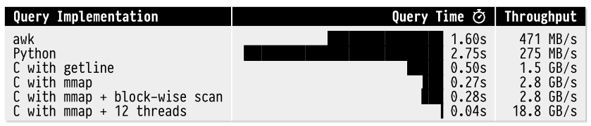

This is my vision for what ldrs is and is not, what I want it to be, where it fits in the ecosystem, and the technical decisions I have made. 

## What ldrs is and is not
I feel that ldrs can fill a gap in any data ecosystem. Whether that gap is the entire ELT pipeline or just a tool that is used in development to quickly move data around, ldrs is for you.

- ldrs is the E and L of ELT. You are transforming late and not during extraction or loading, correct? ldrs can help enforce that with minimal transforms and source to destination semantics.
- ldrs is a single binary, it is not a platform or a "cloud". It is designed to run on your machines or in your cloud accounts. ldrs can be totally air-gapped and run in a private network of your design.
- ldrs is designed for small to medium data. It is designed to help teams move data without spinning up Spark, or jumping onto DataBricks, or ceding control to Snowflake or any other cloud provider. All of that being said it works with any accounts or data sources you do have.  
- ldrs is not a transformation tool. Transforms happen in the destination, not in ldrs. And the transforms are most likely done with dbt. This does not compete with dbt as ldrs should be done before dbt runs. 
- ldrs is not a query engine. It is designed to get all the data from source to destination.

If you are already using Spark, DataBricks, or plugged into the Snowflake ecosystem, then ldrs may not be for you and your team. Although, ldrs can fit into the cracks between these platforms and extremely helpful for development and testing.

## Guiding principles
These are the items that help keep me grounded to the vision and what I am trying to build. 

- **Clean abstractions** - Abstractions are powerful. And they are very difficult. I have used tools where you could feel the abstractions leak as you used them. ldrs landed on two key core abstractions:
  - Apache Arrow as the data transfer format. As long as I can turn any source into a stream of Arrow RecordBatches, I can abstract and standardize the pipeline. 
  - PostgreSQL data types as the ldrs logical data types. These are technically SQL data types as Postgres just adopts them. I did not try to fully implement all of the types, just a subset that can fully capture all of the data types from Arrow, Parquet, and pretty much any other data source. This creates a path to maintain a logical type even when the underlying binary type is a byte array or string that does not have a clean logical type.
- **Binary compatibility** - Building on clean abstractions, ldrs can express the logical type of sources and destinations. I have used multiple tools where I felt at the mercy of decisions made about how to parse, transfer, and write data. I wanted to create something that could pass "The Hobbit" test; *There and Back Again*. So can the tool take data transfer it to another location (and even another format) and then bring it back again without losing any data granularity? 
- **Zero-configuration** - ldrs will move data from source to destination and use the default mappings from Arrow data types to the destination data types. There will be no data loss doing this. ldrs can also have extensive configuration options and overrides to fully control what happens as well.
- **Zero-state** - The path and the file itself is part of the configuration of how to move the data. There is no external metadata, store, or database that will need to be read to know how to process the data. This is an abstraction choice that keeps the process of what (as long as it can Arrow) and where the data is sourced as a black box to ldrs moving the data. There is no platform, just a directory full of files that point to sources and destinations. 
- **Stream of Data** - ldrs is designed to move streams of Arrow RecordBatches. Related to the zero-state principle, ldrs does not need to know how many rows or how many batches are coming. It will process 1 row or 10 million rows the same way.
- **Zero allocations (Rust-specific)** - ldrs avoids allocating memory for any of the data contained in the Arrow record array. This has the benefit of keeping ldrs very memory efficient and not wasting CPU cycles on memory management, and keeping the value proposition of Arrow, which is vectorized arrays of data. Of course at the write boundary there is an allocation into the destination, but ldrs tries not to do any intermediate allocations.

## Why Rust? 
Rust was chosen for a couple of reasons, first I wanted to build something in Rust that also required the performance of Rust. Second, I wanted to build something that would try to be as fast as possible moving data. Humans get distracted when things take too long.

DuckDB has an excellent series of [lectures](https://duckdb.org/library/design-and-implementation-of-duckdb-internals/) on the design and implementation of DuckDb internals. The following is from Lecture 2 - https://blobs.duckdb.org/slides/DiDi-02.pdf.

To be **very clear** here, I am not comparing what I am doing to what DuckDB has built and is building. I am just saying I chose Rust to help me get as far down the performance chart as I could.

To quote the very next line in the document:

> Implementation language and techniques matter **a lot.**

Emphasis retained from the source.
